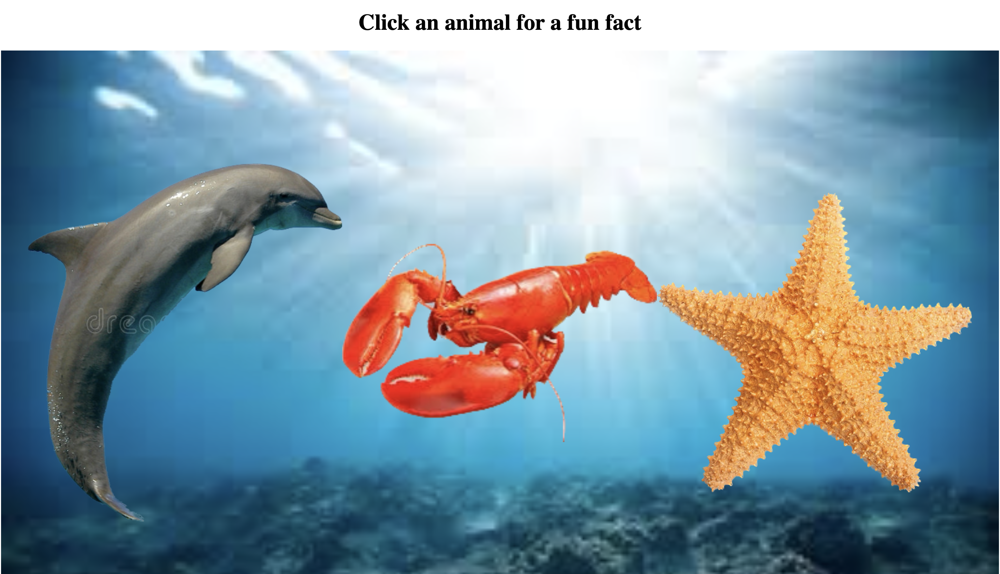
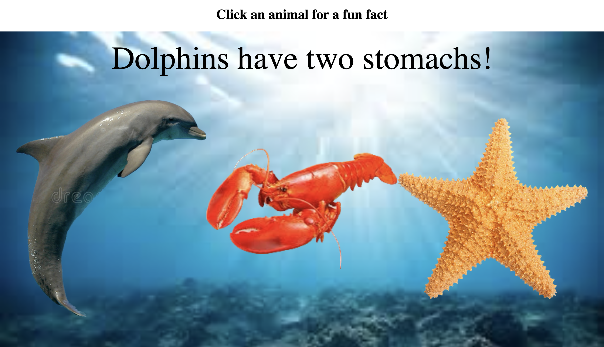

# Animal Facts

Welcome to the Animal Fun Facts project! This program allows users to click on animal images displayed on the screen and get a fun fact about the selected animal. A user can click on different animals to learn various facts about them, making it a fun and educational experience.

## Features

- Interactive animal selection: Click on an animal to view a fun fact about it.
- Random fact generator: Each click on an animal triggers a random fact from a list of potential options.

## Screenshots
Inital look when visiting the site

Clicking at an animal generates a random funfact

## Author

- [@bisrat415](https://github.com/bisrat415)

## Acknowledgements

 - [Codecademy - Learn React: Advanced JSX and the Virtual DOM](https://www.codecademy.com/learn/learn-react-introduction)
 - [Linkedin Learning - React.js Essential Training](https://www.linkedin.com/learning/react-js-essential-training)

## Badges

